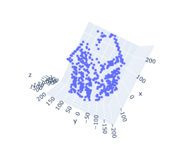

# Affine-Structure-From-Motion
 Reconstructed a 3D scene from a given set of images (HOUSE data) by feature correspondence with RANSAC-based outlier rejection along with triangulation and nonlinear optimization techniques for robust camera pose estimation.

#  Output
<!--  -->

